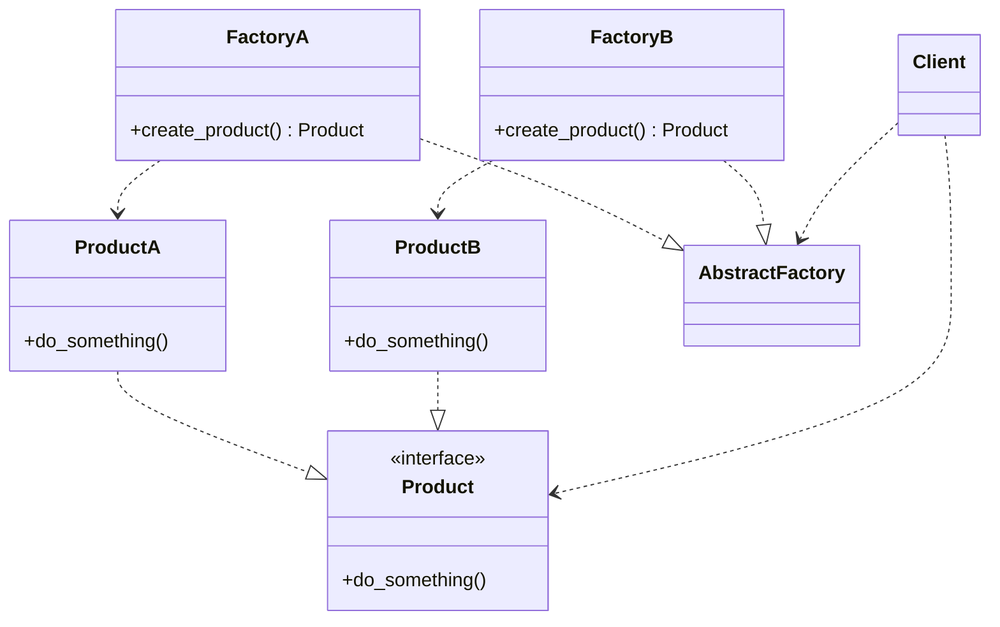

# 工厂方法模式
1. 内容：定义一个用于创建对象的接口（工厂接口），让子类决定实例化哪一个产品类。
2. 角色：抽象工厂角色、具体工厂角色、抽象产品角色、具体产品角色
3. 优点：每个具体产品都对应一个具体工厂类，不需要修改工厂类代码；隐藏了对象创建的细节；实现了开闭原则
4. 缺点：每增加一个具体产品类，就必须增加一个相应的具体工厂类

# 类图

```mermaid
classDiagram
class Client
class Product
<<interface>> Product
Product : +do_something()
class ProductA
ProductA : +do_something()
class ProductB
ProductB : +do_something()
class AbstractFactory
class FactoryA
FactoryA : +create_product() Product
class FactoryB
FactoryB : +create_product() Product
FactoryA ..|> AbstractFactory
FactoryB ..|> AbstractFactory
ProductA ..|> Product
ProductB ..|> Product
FactoryA ..> ProductA
FactoryB ..> ProductB
Client ..> Product
Client ..> AbstractFactory
```