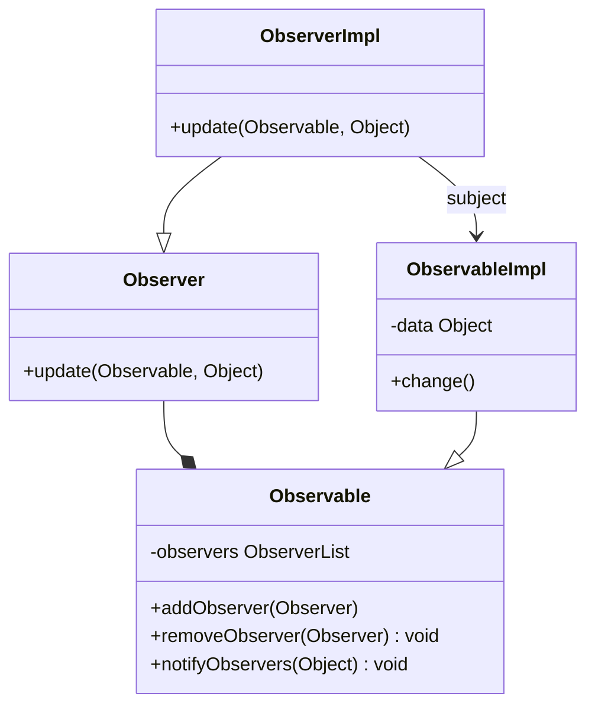
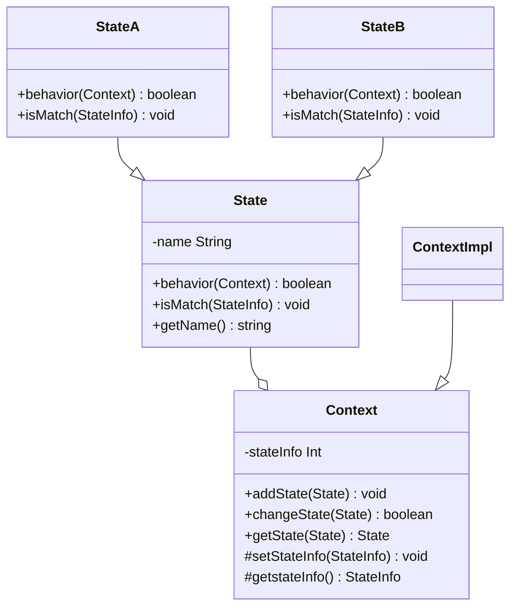
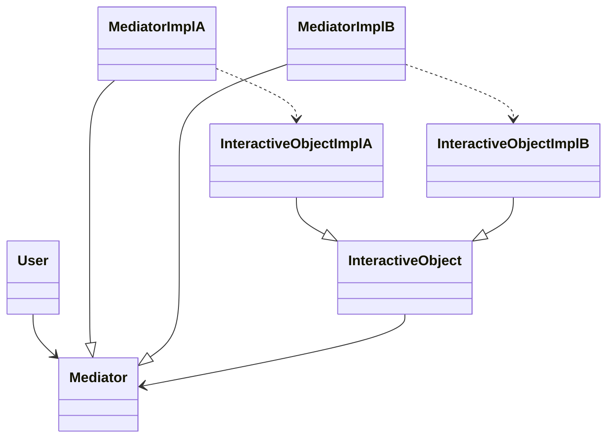
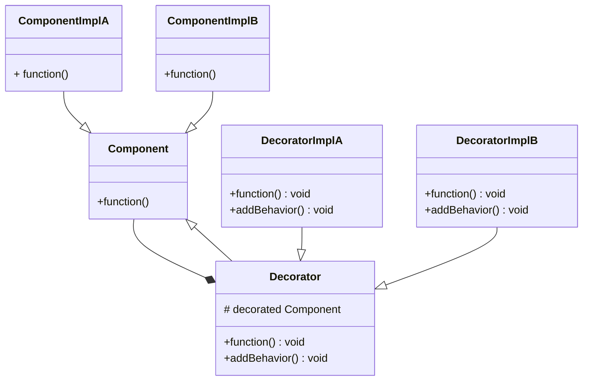

# 设计模式
1. 行为型模式：监听模式、状态模式

# 1. 监听模式（观察者模式）
## 1.1 什么是监听模式
在对象间定义一种**一对多**的**依赖**关系，当这个对象状态发生改变时，所有依赖它的对象都会被通知并自动更新。
监听模式是一种一对多的关系，可以有任意个（一个或多个）观察者对象同时监听某一个对象。被观察者对象在状态或内容（数据）发生变化时，会通知所有观察者对象，使它们能够做出相应的变化（如自动更新自己的信息）

## 1.2 设计思想
监听模式的核心思想就是在被观察者和观察者之间建立一种自动触发的关系

## 1.3 类图
**Observalbe**是**被观察者**的**抽象类**，**Observer**是**观察者**的**抽象类**，addObservers、removeObserver分别用于添加和删除观察者，notifyObservers用于内容或状态变化时通知所有的观察者。因为Observable的notifyObservers会调用Observer的update方法，所以观察者不需要关心被观察者的对象什么时候发生变化，只需要关注update的实现就可以了。

**注：Observable在发送广播通知的时候，无需指定具体的Observer，Observer可以自己决定是否订阅Subject的通知**

## 1.4 应用场景
1. 对一个对象状态或数据的更新需要其他对象同步更新，或者一个对象的更新需要依赖另一个对象的更新
2. 对象仅需要将自己的更新通知给其他对象而不需要知道其他对象的细节，如消息推送

# 2. 状态模式

## 2.1 什么是状态模式
允许一个对象在其内部状态模式发生改变时改变其行为，使这个对象看上去就像改变了它的类型一样。状态模式又称对象的行为模式。

## 2.2 设计思想
一个事物（对象）有多种状态，在不同的状态下所表现的行为和属性不一样

## 2.3 类图

State是抽象状态类（基类），负责状态对的定义和接口的统一。StateA和StateB是具体状态类。Context是上下文环境类，用于具体状态的切换。

## 2.4 优缺点
1. 优点：封装了状态的转换规则，在状态模式中可以将状态的转换代码封装在环境类中，对状态转换代码进行集中管理；将所有与某个状态有关的行为放到一个类中（称为状态类）；允许状态转换逻辑与状态对象合为一体，使用时只需要注入一个不同的状态对象即可使环境对象拥有不同的行为。
2. 缺点：会增加系统类和对象的个数；状态模式的结构与实现都较为复杂，如果使用不当容易导致程序结构和代码的混乱。

## 2.5 应用场景
1. 一个对象的行为取决于它的状态，并且在运行时可能经常改变它的状态；
2. 一个操作中含有庞大的多分支条件语句，这些分支依赖于该对象的状态，且每一个分支的业务逻辑都非常复杂。

# 3. 中介模式

## 3.1 什么事中介模式
用一个中介对象来封装一系列的对象交互，中介者使各对象不需要显式地相互引用，从而使其耦合松散，而且可以独立地改变它们之间的交互。中介模式又称调停模式。

## 3.2 设计思想
在很多系统中，多个类容易相互耦合，形成网状结构。中介模式就是将这种网状结构分离成星状结构，使各对象间的结构更加简洁，交互更加顺畅

## 3.3 类图

Medaitor就是中介类，用来协调对象间的交互。中介类可以有多个具体实现类，如MediatorImplA、MediatorImplB。InteractiveObject是要进行交互的对象，如House Owner和Custmer。InteractiveObject可以是互不相干的多个类的对象，也可以是具有继承关系的相似类。

## 3.4 优缺点
1. 优点：Mediator将原本分布于多个对象间的行为集中在一起，作为一个独立的概念并将其封装在一个对象中，简化了对象之间的交互；将多个调用者和多个实现者之间多对多的交互关系，转换为一对多的交互关系，一对多的交互关系更易于理解、维护和扩展，大大减少了多个对象之间相互交叉引用的情况。
2. 缺点：中介者承受了所有的交互逻辑，交互的复杂度转换了中介者的复杂度，中介者类会变得越来越庞大和复杂；中介者出现问题会导致多个使用者出现问题

## 3.5 应用场景
1. 一组对象以定义良好但复杂的方式进行通信。产生的相互依赖关系结构混乱且难以理解；
2. 一个对象引用其他很多对象并且直接与这些对象通信，导致难以服用该对象；
3. 想通过一个中间类来封装多个类中的行为，同时又不想生成太多的子类。

# 4. 装饰模式
## 4.1 什么是装饰模式
动态地给一个对象增加一些额外的职责，就拓展对象功能来说，装饰模式比生成子类的方式更为灵活

## 4.2 设计思想
动态地给一个类增加额外的功能，而不该动原有的代码，就可以用装饰模式进行拓展。

## 4.3 类图

Component是一个抽象类，代表具有某种功能（function）的组件，ComponentImplA和ComponentImplB分别是其具体的实现子类。Decorator是Component的装饰器，里面有一个Component的对象decorated，这就是被装饰的对象。装饰器可为被装饰对象添加额外的功能或行为（addBehavior）。DecoratorImplA和DecoratorImplB分别是两个具体的装饰器（实现子类）

## 4.4 优缺点
1. 优点：使用装饰模式来实现扩展比使用继承更加灵活；可以动态地给一个对象附加更多的功能；可以用不同的装饰器进行多重装饰，装饰的顺序不同，可能产生不同的效果；装饰类和被装饰类可以独立发展，不相互耦合。
2. 缺点：与继承相比，用装饰的方式扩展功能容易出错，排错也更困难。

## 4.5 应用场景
1. 有大量独立的扩展，为支持每一种组合将产生大量的子类
2. 需要动态地增加或撤销功能时；
3. 不能采用生成子类的方式进行扩充时，类的定义不能用于生成子类